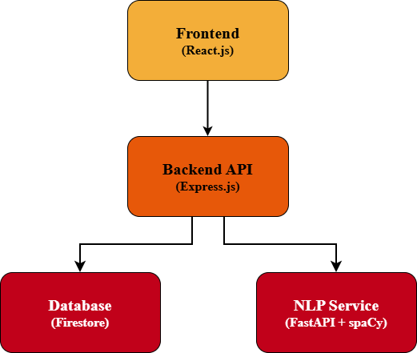

A mention of moths might invoke different associations for different people - some think of butterflies, others think of the lantern-loving creatures who sometimes like to munch on clothing, while a portion of readers gets reminded of the "urban legend" regarding the infamous moth that was extracted from a computer in the mid-20th century and immortalized by being taped into an engineer's logbook as a physical, very literal bug report.

"Where's the Moth?", inspired by the "first computer bug", is a web-app that aims to be an enhancement in the learning process for manual QA engineers while presented in a form lots of people in this field love - a game. With a series of intentionally flawed web modules, the goal is to identify defects, document them in professional bug reports, and receive automated feedback on report quality through an NLP-powered evaluation system.

## What features does the app include?
- 5 interactive testing levels containing defects of varying severity
- Bug report submission system
- Rule-based report assessment
- Report quality evaluation powered by Natural Language Processing (NLP)
- Session tracking and completion statistics
- User authentication with Firebase Authentication

## What's the technology stack?

### Frontend
- React.js
- React Router
- TailwindCSS
- Firebase Authentication

### Backend
- Node.js
- Express.js
- Firebase Admin SDK
- Firestore database

### NLP Service
- Python
- FastAPI
- spaCy

## A few words about the architecture?



To put it simply, the system consists of 3 main components: React.js frontend, Express.js backend, and a Python-based NLP service.
The frontend provides the user with the interface and sends requests to the backend whenever a report is submitted or a level is completed. The backend processes these requests, stores application data in Firestore, and communicates with the NLP service when report evaluation is required.
The NLP service analyzes submitted reports and returns evaluation scores and feedback. The backend stores those results and supplies them to the frontend, where they are displayed in the completion summary.

## NLP evaluation - what is that?

Submitted reports are compared against predefined bug examples stored in the bug database. The evaluator analyzes:
- Bug summary
- Steps to reproduce
- Actual result
- Expected result
- Severity
- Bug type

An overall score and feedback comments are generated and displayed when a level is completed.

## Awesome, now how do I run the app?

### There are some prerequisites before doing so:
- Node.js (v22+)
- Python (v3.11.x - v.3.12.x)
- Firebase Service Account Key

### Installation

Clone this repository:
```
git clone https://github.com/Nabillera/Web-Testing-Simulator.git
```

Place the provided Firebase service account key in:
```
backend/config/serviceAccountKey.json
```

Run the setup script:
```
./setup.bat
```

It installs all required dependencies for frontend, backend, and NLP service. Once the installation is complete, we can start the application:
```
./run-app.bat
```

The launcher will automatically start all three components:
- Frontend on port 5173
- Backend on port 5000
- NLP Service on port 8000

All that is left to do is go to the following address in the browser:
```
http://localhost:5173
```

Happy exploring!